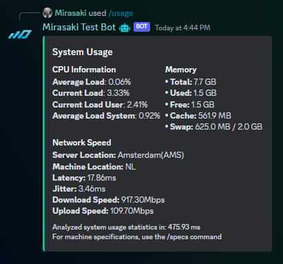
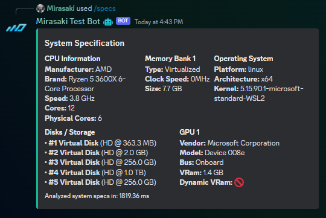

# server-usage-bot

A Discord bot that display performance statistics for your dedicated server/PC. Uses [CloudFlare Speed Test](https://speed.cloudflare.com/) for networks statistics. For Linux, macOS, partial Windows, FreeBSD, OpenBSD, NetBSD, SunOS and Android. Dependency free.

## Table of Contents

- [Hosting](#hosting)
- [Discord Permissions](#discord-permissions)
- [Installation & Usage](#installation--usage)
  - [Prerequisites](#prerequisites)
  - [Docker](#run-as-a-docker-container-preferred)
  - [Node](#run-as-a-plain-nodejs-app)

## Hosting

We have partnered with [VYKIX.com](https://portal.vykix.com/aff.php?aff=17) after observing many of our clients using VYKIX services and products. Check them out for affordable and reliable hosting, they bring the **best DayZ hosting experience possible.** 📈

## Discord Permissions

The bot doesn't require any permissions

Invite the bot to your server by navigating to the following URL (replace `YOUR_CLIENT_ID` with `CLIENT_ID` from the `.env` file):

`https://discord.com/api/oauth2/authorize?client_id=YOUR_CLIENT_ID&permissions=0&scope=bot%20applications.commands`

Any command can be used without any Discord permissions, as long as the bot is invited to your server with the `bot` and `applications.commands` scopes. You can use the template url above, or alternatively, generate an invite link in the [Discord Developer Portal](https://discord.com/developers/applications) (Your App > OAuth2 > URL Generator > `scopes: bot + applications.commands`)

## Installation & Usage

### Prerequisites

- A [Discord Bot account](https://discord.com/developers/applications "Discord Developer Portal")
    1) Head over to the page linked above
    2) Click "New Application" in the top right
    3) Give it a cool name and click "Create"
    4) Click "Bot" in the left hand panel
    5) Click "Add Bot" -> "Yes, do it!"
    6) Click "Reset Token" and copy it to your clipboard, you will need it later
- [NodeJS](https://nodejs.org/en/download/ "Node official website") (if you're running as a plain NodeJS app)
    1) Head over to the download page
    2) Download the latest LTS build available for your OS
    3) Be sure to check the box that says "Automatically install the necessary tools" when you're running the installation wizard

### Run as a Docker container (preferred)

The quickest and easiest way to host/use this bot is by deploying it inside of a [Docker](https://docs.docker.com/engine/install/ "Official Docker Website") container.

> *A [**docker-compose**](https://docs.docker.com/compose/ "View docker-compose documentation") file is included for your convenience*

1. Clone this repository: `git clone https://github.com/Mirasaki/server-usage-bot.git`
2. Navigate inside the new folder: `cd server-usage-bot`
3. Rename `/.env.example` to `.env` and provide your environmental variables
    - Windows users often experience issues with this file, if you're getting errors that the env file can't be found, or `Expected path argument to be of type string` - check out [this timestamped video](https://youtu.be/6rOCUZ8opLM?t=42)
4. Build the application: `npm run build`
5. Build the Docker image: `docker build --tag my-server-usage-bot .`
6. Start the bot: `docker run -it --env-file .env --name my-server-usage-bot mirasaki/server-usage-bot:main`

### Run as a plain NodeJS app

You can also clone this repository or download a release, and host the project directly. You will need [Node/NodeJS](https://nodejs.org/en/ "Node official website") (Be sure to check the box that says "Automatically install the necessary tools" when you're running the installation wizard)

1. Head over to [the download page](https://github.com/Mirasaki/server-usage-bot/releases/)
    - Alternatively, clone this repository by using `git clone https://github.com/Mirasaki/server-usage-bot.git` and skip to step 4 if you have [Git](https://git-scm.com/downloads "Git Download Section") installed
2. Download either the `zip` or `zip.gz` source code
3. Extract it using [your favorite zip tool](https://www.rarlab.com/download.htm "It's WinRar, duh")
4. Open a new console/terminal/shell window in the newly created project folder
5. Run `npm install --exclude=dev` to install all dependencies
6. Rename [`/.env.example`](/.env.example "View .env.example file in current repository") to `.env` and configure your environmental variables
7. Build the application: `npm run build`
8. Use the command `node .` to start the application, or alternatively:
    - `npm run start` to keep the process alive with [PM2](https://pm2.io/ "PM2 | Official Website"), suitable for production environments. (`npm i -g pm2` to install)
    - `npm run dev` if you have `nodemon` installed for automatic restarts on changes, suitable for development environments

> Open source, self-hosted, and MIT licensed, meaning you're in full control.
